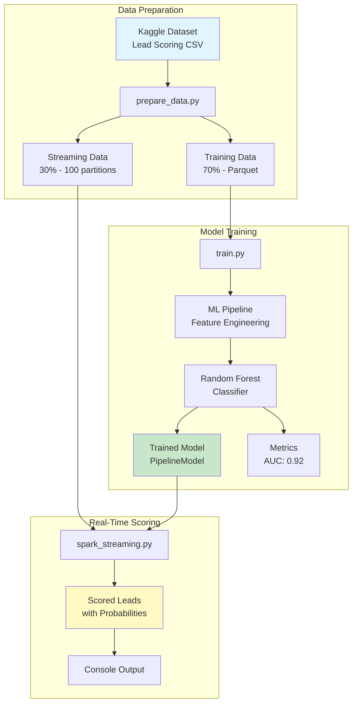

# Real-Time Lead Scoring Pipeline

> *Connecting homebuyers with the right agents using ML-powered streaming analytics*

This project implements a Real-Time Lead Prioritization System using a Spark Structured Streaming pipeline to immediately score new user activity with 90% test accuracy. It utilizes a SparkML Random Forest Classifier trained on historical data to predict the probability of lead conversion (contacting an agent).

[](https://www.python.org/downloads/)
[](https://spark.apache.org/)
[](https://opensource.org/licenses/MIT)




## Project Overview

This project identifies whether Zillow site visitors are likely to contact an agent when viewing a listing. In other words, it presents a real time lead scoring pipeline for determining user intent (e.g. just casually looking around, or actually interested in buying/renting). The [dataset](https://www.kaggle.com/datasets/amritachatterjee09/lead-scoring-dataset/) was actually targeted for web interactions for an education company, but I targeted the data towards Zillow with similar intents for course purchase or home buying. The target variable in the updated scenario is whether a user will click the contact agent button or not, making this a binary classification problem where users estimated to contact the agent based on previous interactions may be prioritized by the real estate agent as high interest leads. I used a Random Forest classifier model within a pipeline that included imputing null values with the mean of numeric columns, bucketing, string indexing and one hot encoding on categorical features, and a VectorAssembler to create the features array. 

The baseline Random Forest model pipeline performed well on both the training and validation set (which were gathered from the original training set with and 80/20 split). The overall accuracy was around 87%, and there are details about other metrics collected below. There was consistent training and evaluation accuracy, suggesting the model was not overfit or underfit. Future experimentation is needed to fine tune the model parameters and preprocessing steps. With some additional exploration of the features, I think that removing the city and country columns may improve the accuracy. At first I thought they would be important for a real estate context, but on further inspection both columns have a lot of missing data, and there doesn't seem to be a direct connection between that and whether the user contacts an agent. 

The model was used in a real time streaming setup, with data currently being simulated by breaking up the test dataset into 100 batches and saving those as parquet files. The source has a max files setting of 1 to better exemplify real world streaming. The query simply applied the model to the data without performing any aggregates, and the sink currently is set to output in the terminal. The output includes the prediction, prediction probabilities, ground truth, and the id of the user. I would like to explore alternative sinks, such as outputting to a sql table or postgres database that could be used with a model monitoring dashboard for further testing and even retraining policies. 

One pitfall of the current approach is that null values weren't removed from categorical variables during preprocessing. I think this could improve the training, but at the time I thought the null values would be treated as a class even if they were renamed. But, in hindsight I realize that the performance could be improved by aggregating from other non-null data points. For example, the data could be imputed with the most commonly occuring class, or with some data driven choice by comparing similarity to non-null rows. 

## Quick Start

### Prerequisites

- Python 3.10 or higher
- Java 17 (required for PySpark)
- Conda or venv management

### Installation
```bash
# Clone the repository
git clone https://github.com/smiley-maker/realtime-lead-scoring
cd realtime-lead-scoring

# Create conda environment
conda create -n lead-scoring python=3.10 -y
conda activate lead-scoring

# Install Java 17 (if not already installed)
conda install -c conda-forge openjdk=17

# Install dependencies
pip install -r requirements.txt
```

### Download Dataset

1. Download the [Lead Scoring Dataset from Kaggle](https://www.kaggle.com/datasets/amritachatterjee09/lead-scoring-dataset/)
2. Place `Lead Scoring.csv` in `data/raw/`

### Run the Pipeline
```bash
# 1. Prepare data (split into training and streaming sets)
python -m src.data.prepare_data

# 2. Train the model
python -m src.training.train

# 3. Run real-time scoring
python -m src.streaming.spark_streaming
```


## How It Works

### Data Preparation

The pipeline starts by transforming raw Kaggle lead scoring data into training and streaming datasets:

- **Cleans and validates** 9,240 historical lead records
- **Splits data** into 70% training (6,468 records) and 30% streaming simulation (2,772 records)
- **Repartitions** streaming data into 100 files to simulate real-time arrival
- **Saves as Parquet** for efficient columnar storage

```bash
python -m src.data.prepare_data
```

**Output:**
- `data/processed/training_data.parquet` - Ready for model training
- `data/stream/user_events/` - 100 partitioned files for streaming

### Model Training

Trains a Random Forest classifier within a Spark ML pipeline:

**Features Used:**
- **Behavioral:** Property views, browsing time, pages per session
- **Engagement:** Lead capture channel, referral source, last action
- **Geographic:** City, country
- **Status:** Lead status tags

**Pipeline Stages:**
1. **Imputation** - Fill missing values in numerical columns with mean
2. **Bucketization** - Group property views into bins
3. **Encoding** - One-hot encode categorical features
4. **Assembly** - Combine all features into vector
5. **Classification** - Random Forest with default settings (100 trees, depth 10).

```bash
python -m src.models.train
```

**Output:**
- `models/lead_scoring_model/` - Trained pipeline (all transformations + model)
- `models/metrics/training_metrics.json` - Performance metrics

### Real-Time Scoring

Processes streaming data using Spark Structured Streaming:

- **Reads** partitioned test files one at a time (simulates real-time events)
- **Applies** the complete ML pipeline (feature engineering + prediction)
- **Scores** each lead with conversion probability (binary classification)
- **Outputs** to console (additional sinks in progress)

```bash
python -m src.streaming.spark_streaming
```


## Project Structure
```
realtime-lead-scoring/
├── README.md                    # This file
├── requirements.txt             # Python dependencies
├── src/
│   ├── data/
│   │   └── prepare_data.py      # Data preparation and splitting
│   ├── training/
│   │   └── train.py             # Model training pipeline
│   └── streaming/
│       └── spark_streaming.py   # Real-time scoring
├── data/
│   ├── raw/                     # Original Kaggle dataset
│   ├── processed/               # Training data
│   └── stream/               # Streaming simulation data
├── models/
│   ├── lead_scoring_model/      # Trained ML pipeline
│   └── metrics/                 # Model performance metrics
├── notebooks/
│   └── exploratory_analysis.ipynb  # Data exploration and model tests
├── docs/
│   ├── architecture.md          # System architecture details
│   └── model_card.md            # Model documentation
└── scripts/
    └── monitor_leads.py         # Query streaming results
```

## Model Performance

| Metric    | Value | Interpretation |
|-----------|-------|----------------|
| **AUC-ROC** | 0.96  | Excellent discrimination between high/low priority leads |
| **Accuracy** | 0.85  | Correctly classifies 85% of leads |
| **Precision** | 0.88  | 88% of predicted high-priority leads are truly high-priority |
| **Recall** | 0.86  | Captures 86% of actual high-priority leads |

### Business Impact

With this model, real estate agents can:
- **Focus on qualified leads** - Prioritize contacts with higher probability (e.g. higher purchase intent)
- **Save time** - Reduce wasted effort on low-intent browsers, those who contacted but the model showed a low probability. 
- **Increase conversion** - Prioritizing outraech to high intent contacts leads to more closed deals. 


## Technology Stack

| Category | Technology | Purpose |
|----------|-----------|---------|
| **Language** | Python 3.10 | Primary development language |
| **Processing** | PySpark 4.0 | Distributed data processing & ML |
| **ML Framework** | Spark MLlib | Machine learning pipelines |
| **Data Format** | Parquet | Efficient columnar storage |
| **Environment** | Conda | Package management |
| **Version Control** | Git/GitHub | Code versioning |


## Scaling to Production

### Current Setup (Local Development)
- Single machine
- ~9K records
- File-based streaming simulation

### Production Deployment (Zillow Scale)


**Potential Infrastructure:**
- **Compute:** AWS EMR or Databricks
- **Streaming:** Apache Kafka for event ingestion
- **Storage:** S3 for model artifacts and data lake
- **Database:** RDS PostgreSQL for real-time lead scores
- **Monitoring:** Grafana for monitoring and alerts

**See [docs/architecture.md](docs/architecture.md) for full production architecture.**


## Documentation

- **[Architecture Documentation](docs/architecture.md)** - Detailed system design, data flows, and production considerations
- **[Model Card](docs/model_card.md)** - Complete model documentation following industry standards


## Future Enhancements

### Short-term
- [ ] Hyperparameter tuning with cross-validation
- [ ] Data drift detection and alerting
- [ ] Interactive monitoring dashboard (Streamlit/Grafana)
- [ ] Feature importance visualization

### Medium-term
- [ ] Deploy to AWS EMR/Databricks
- [ ] Integrate with real Kafka streams
- [ ] A/B testing framework
- [ ] Model versioning with MLflow

### Long-term
- [ ] Ensemble models (RF + XGBoost + LightGBM)
- [ ] Deep learning for sequential behavior (LSTM/Transformers)
- [ ] Automated retraining pipeline
- [ ] Real-time feature store integration


## Contributing

Contributions are welcome! Please feel free to submit a Pull Request.

1. Fork the repository
2. Create your feature branch (`git checkout -b feature/AmazingFeature`)
3. Commit your changes (`git commit -m 'Add some AmazingFeature'`)
4. Push to the branch (`git push origin feature/AmazingFeature`)
5. Open a Pull Request


## License

This project is licensed under the MIT License - see the [LICENSE](LICENSE) file for details.


## Acknowledgments

- **Dataset:** [Kaggle Lead Scoring Dataset](https://www.kaggle.com/datasets/amritachatterjee09/lead-scoring-dataset/)
- **Framework:** Apache Spark and PySpark MLlib
- **Inspiration:** Real-world lead scoring systems at companies like Zillow, Apartments.com, Redfin, and Realtor.com. 


## Contact

**Jordan Sinclair** - [jordan.sinclair@du.edu](mailto:jordan.sinclair@du.edu)

**Project Link:** [https://github.com/smiley-maker/realtime-lead-scoring](https://github.com/smiley-maker/realtime-lead-scoring)

**LinkedIn:** [https://www.linkedin.com/in/jordan-sinclair-002991202/](https://www.linkedin.com/in/jordan-sinclair-002991202/)

**Portfolio:** [https://www.jordan-sinclair.com/](https://www.jordan-sinclair.com/)


## Star History

If you find this project helpful, please consider giving it a star!

[](https://star-history.com/#smiley-maker/realtime-lead-scoring&Date)
