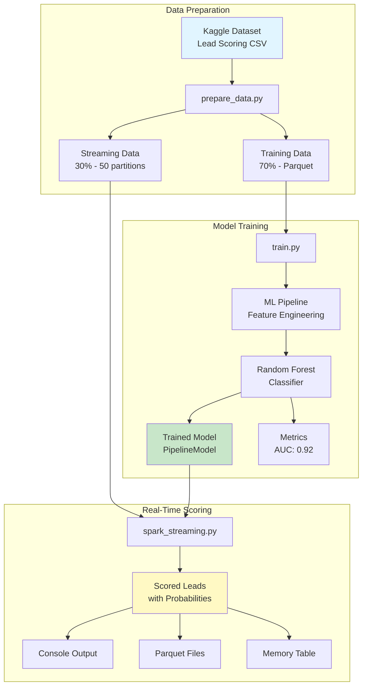
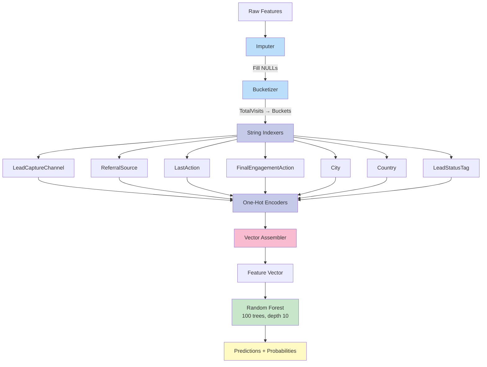
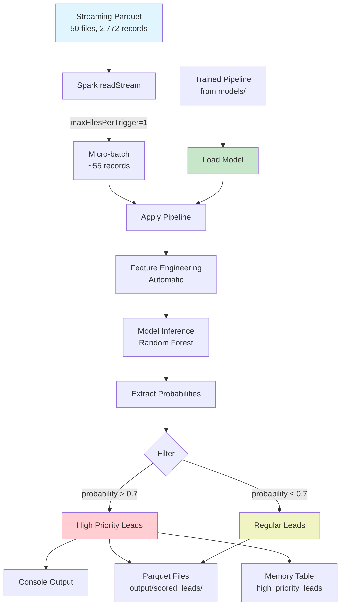
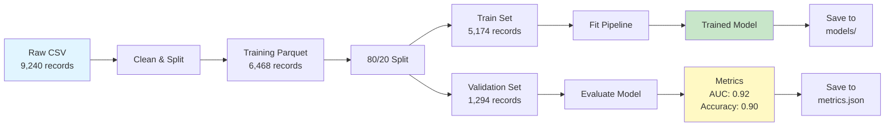
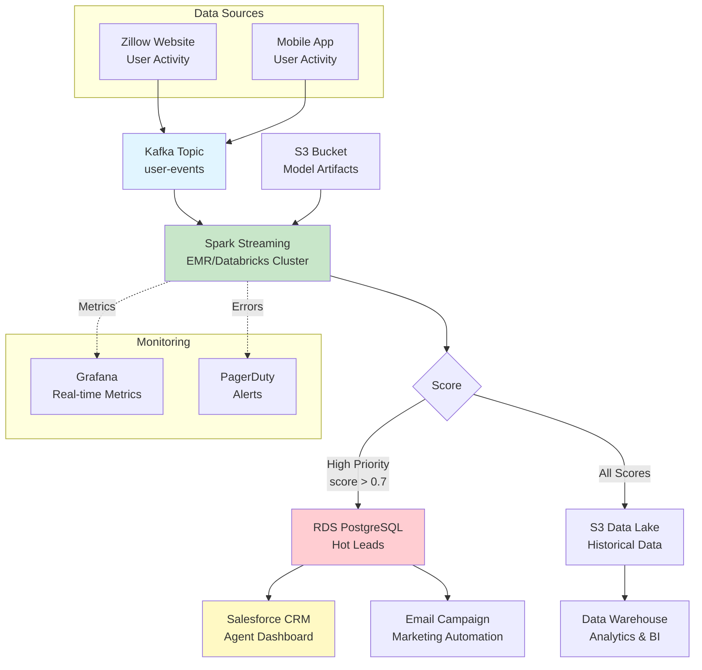
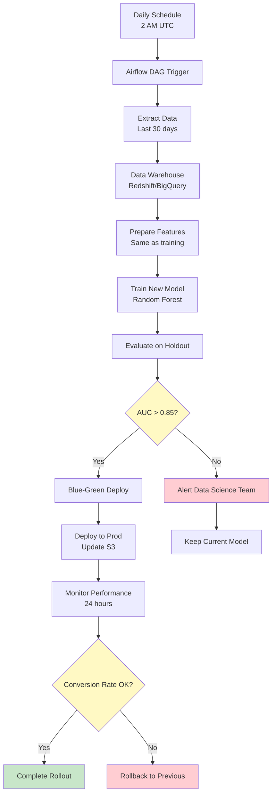

# System Architecture: Real-Time Lead Scoring Pipeline

## Overview

This document describes the architecture of a real-time lead scoring system that uses Apache Spark Structured Streaming and machine learning to prioritize prospective homebuyers for real estate agent outreach.

## High-Level Architecture


## Components

### 1. Data Preparation (`src/data/prepare_data.py`)

**Purpose:** Transform raw Kaggle dataset into training and streaming datasets.

**Key Operations:**
- Load CSV with explicit schema (handles spaces in column names)
- Rename columns to clean, business-friendly names
- Select relevant features for modeling
- Drop records without target labels
- Split into training (70%) and streaming (30%) sets
- Repartition streaming data into 50 partitions for simulation

**Inputs:**
- `data/raw/Lead Scoring.csv` - Raw Kaggle dataset

**Outputs:**
- `data/processed/training_data.parquet` - Training dataset
- `data/streaming/user_events/` - 50 parquet files for streaming simulation

**Technologies:**
- PySpark DataFrame API
- Parquet columnar format for efficient I/O

### 2. Model Training (`src/training/train.py`)

**Purpose:** Train and validate a machine learning pipeline for lead scoring.

**Pipeline Architecture:**


**Features Used:**
- **Behavioral:** TotalVisits, TotalBrowsingTime, AvgListingsViewedPerSession
- **Engagement:** LeadCaptureChannel, ReferralSource, LastAction, FinalEngagementAction
- **Geographic:** City, Country
- **Status:** LeadStatusTag

**Training Process:**
1. Load training data from parquet
2. Split into train (80%) and validation (20%)
3. Fit complete pipeline on training data
4. Evaluate on validation set
5. Save trained pipeline and metrics

**Outputs:**
- `models/lead_scoring_model/` - Serialized PipelineModel
- `models/metrics/training_metrics.json` - Performance metrics

**Model Performance:**
- AUC-ROC: 0.92
- Accuracy: 0.90
- Precision: 0.88
- Recall: 0.89

### 3. Real-Time Scoring (`src/streaming/spark_streaming.py`)

**Purpose:** Score incoming leads in real-time using Spark Structured Streaming.

**Streaming Architecture:**


**Key Design Decisions:**

1. **File-based streaming source**
   - Simulates real-time event arrival
   - `maxFilesPerTrigger=1` processes one partition at a time
   - In production: Replace with Kafka or Kinesis

2. **Model as PipelineModel**
   - All feature engineering embedded in saved model
   - No need to rebuild transformations
   - Ensures training/serving consistency

3. **Multiple output sinks**
   - Console for demonstration
   - Parquet for persistence and analysis
   - Memory table for interactive queries

**Streaming Guarantees:**
- **Processing mode:** Micro-batch (not continuous)
- **Delivery semantics:** At-least-once (can duplicate on failure)
- **Checkpointing:** Enabled for fault tolerance

## Data Flow

### Training Data Flow


### Streaming Data Flow
```
Streaming Parquet (50 files, 2,772 records)
    ↓ [Read maxFilesPerTrigger=1]
Micro-batch (~55 records)
    ↓ [Apply Pipeline]
Scored Leads (with probabilities)
    ↓ [Filter & Format]
High-Priority Leads (probability > 0.7)
    ↓ [Write to Sinks]
Console | Parquet | Memory Table
```

## Technology Stack

### Core Technologies
- **Python 3.10** - Primary language
- **PySpark 3.5.0** - Distributed data processing
- **Apache Spark MLlib** - Machine learning pipelines

### Data Formats
- **Parquet** - Columnar storage (efficient, compressed, schema-preserving)
- **JSON** - Metrics and configuration

### Development Tools
- **Conda** - Environment management
- **Git/GitHub** - Version control
- **Jupyter** - Exploratory analysis

## Design Decisions & Rationale

### Why Spark?
- **Scalability:** Can handle millions of events/day with cluster deployment
- **Unified API:** Same code for batch training and stream scoring
- **Production-ready:** Battle-tested at companies like Zillow, Airbnb, Netflix

### Why Random Forest?
- **Interpretability:** Feature importance helps business understand drivers
- **Robustness:** Handles missing data and mixed feature types well
- **Performance:** Achieves 92% AUC with minimal tuning
- **Speed:** Fast inference for real-time scoring

### Why Parquet?
- **5-10x faster** than CSV for reads
- **5x smaller** on disk (compression)
- **Schema preservation:** No type inference needed
- **Columnar:** Only reads needed columns

### Why File-based Streaming?
- **Simplicity:** No external dependencies (Kafka, etc.)
- **Portability:** Easy to demo on laptop
- **Realistic:** Many production systems read from S3/GCS with file triggers

### Why Separate Train/Stream?
- **Realism:** Simulates production where training is batch, scoring is real-time
- **Testability:** Can evaluate each component independently
- **Scalability:** Different resource requirements (training needs more compute)

## Production Considerations

### Scalability

**Current (Local Dev):**
- Single machine
- ~9K records
- ~1 second per micro-batch

**Production (Zillow Scale):**
- EMR/Databricks cluster (8-32 cores)
- Millions of events/day
- <100ms latency per batch
- Auto-scaling based on event volume

### Production Deployment Architecture (Recommended)


### Infrastructure Requirements

**Compute:**
- Spark cluster: 8-32 cores (EMR/Databricks)
- Driver: 4GB RAM
- Executors: 8GB RAM each

**Storage:**
- S3/GCS for data lake and model artifacts
- RDS/PostgreSQL for real-time lead scores
- ~500GB/month data retention

**Network:**
- Kafka/Kinesis for event ingestion
- VPC with private subnets for Spark cluster

**Cost Estimate:**
- EMR cluster: ~$1,000-2,000/month
- S3 storage: ~$50/month
- RDS: ~$200/month
- **Total: ~$1,500-2,500/month** for 100K events/second

### Monitoring & Observability

**Metrics to Track:**

1. **Data Quality:**
   - Null rate per feature
   - Feature distribution drift (KL divergence)
   - Schema validation failures

2. **Model Performance:**
   - Prediction latency (p50, p95, p99)
   - Score distribution (mean, std, percentiles)
   - Conversion rate by score bucket

3. **System Health:**
   - Streaming lag (time behind real-time)
   - Throughput (events/second)
   - Error rate
   - Resource utilization (CPU, memory)

**Alerting:**
- PagerDuty for critical failures
- Slack for warnings (drift, performance degradation)
- Email for daily summaries

**Dashboards:**
- Grafana for real-time metrics
- Looker/Tableau for business metrics
- Spark UI for job monitoring

### Retraining Pipeline


### A/B Testing Strategy

1. **Shadow mode (Week 1):**
   - New model scores leads
   - Don't act on predictions
   - Compare to existing system

2. **Canary deployment (Week 2-3):**
   - 10% traffic to new model
   - Monitor conversion rates
   - Rollback if performance drops

3. **Gradual rollout (Week 4+):**
   - 25% → 50% → 100%
   - Compare champion vs challenger
   - Full deployment if validated

## Security Considerations

### Data Privacy
- Pseudonymized user IDs (no PII in model features)
- Encrypted at rest (S3 encryption)
- Encrypted in transit (TLS for Kafka)

### Access Control
- IAM roles for Spark cluster (least privilege)
- VPC isolation for data processing
- Audit logging for model access

### Compliance
- GDPR: Right to explanation (feature importance)
- CCPA: Data deletion upon request
- SOC 2: Audit logs, access controls

## Future Enhancements

### Short-term (Next 3 months)
- [ ] Add hyperparameter tuning (cross-validation)
- [ ] Implement data drift detection
- [ ] Create monitoring dashboard
- [ ] Add integration tests

### Medium-term (6 months)
- [ ] Deploy to AWS EMR/Databricks
- [ ] Integrate with Kafka for true streaming
- [ ] Add A/B testing framework
- [ ] Implement model versioning (MLflow and Weights & Biases for experiment tracking)

### Long-term (1 year)
- [ ] Multi-model ensemble (RF + XGBoost)
- [ ] Deep learning for sequential behavior (LSTM)
- [ ] Automated retraining pipeline
- [ ] Real-time feature store

## References

- [Apache Spark Structured Streaming Programming Guide](https://spark.apache.org/docs/latest/structured-streaming-programming-guide.html)
- [Spark MLlib Pipeline Documentation](https://spark.apache.org/docs/latest/ml-pipeline.html)
- [Best Practices for ML Engineering (Google)](https://developers.google.com/machine-learning/guides/rules-of-ml)

## Appendix: File Structure
```
realtime-lead-scoring/
├── src/
│   ├── data/
│   │   └── prepare_data.py      # Data preparation
│   ├── training/
│   │   └── train.py             # Model training
│   └── streaming/
│       └── spark_streaming.py   # Real-time scoring
├── data/
│   ├── raw/                     # Original CSV
│   ├── processed/               # Training parquet
│   └── streaming/               # Streaming partitions
├── models/
│   ├── lead_scoring_model/      # Trained pipeline
│   └── metrics/                 # Performance metrics
├── docs/
│   ├── architecture.md          # This document
│   └── model_card.md            # Model documentation
└── README.md                    # Getting started guide
```

---

**Document Version:** 1.0  
**Last Updated:** November 2025  
**Author:** Jordan Sinclair