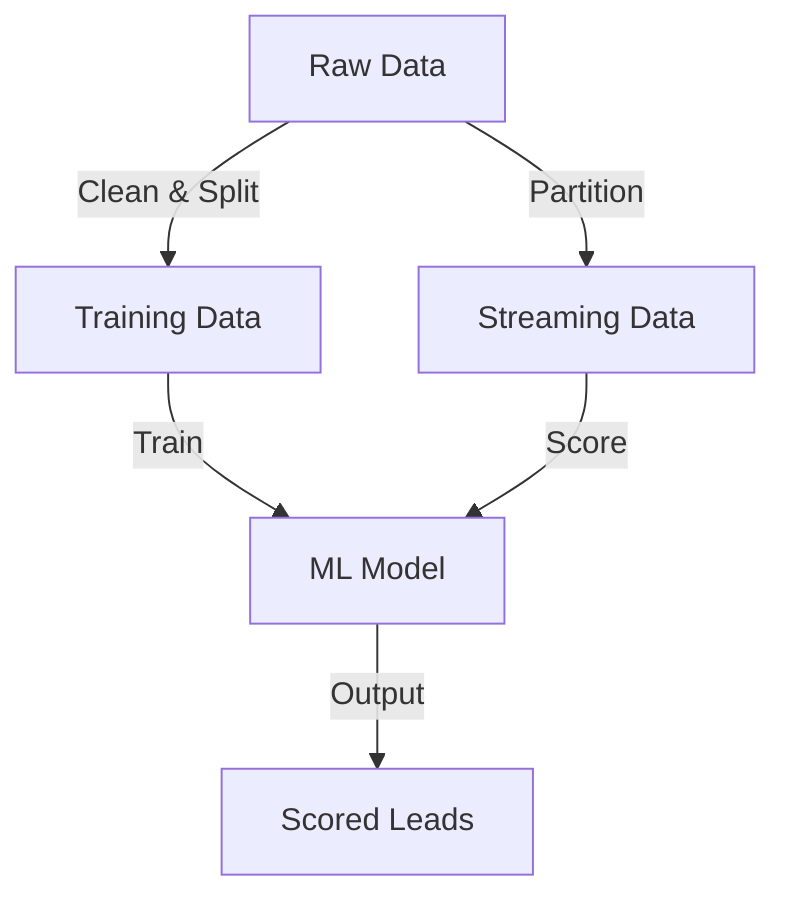
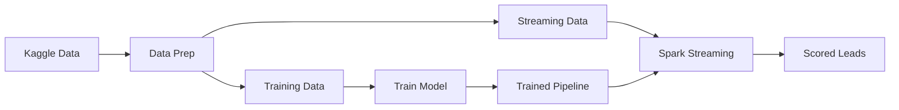

```mermaid
graph TD
    A[Raw Data] -->|Clean & Split| B[Training Data]
    A -->|Partition| C[Streaming Data]
    B -->|Train| D[ML Model]
    C -->|Score| D
    D -->|Output| E[Scored Leads]
```

## System Flow

```mermaid
flowchart LR
    A[Kaggle Data] --> B[Data Prep]
    B --> C[Training Data]
    B --> D[Streaming Data]
    C --> E[Train Model]
    E --> F[Trained Pipeline]
    D --> G[Spark Streaming]
    F --> G
    G --> H[Scored Leads]
```